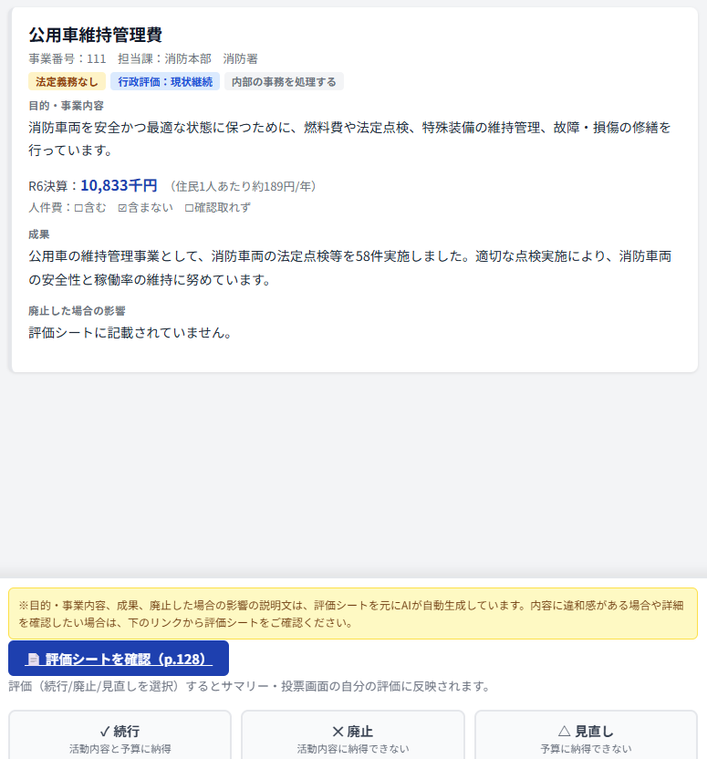

# 住民による事務事業優先度評価ツール

各自治体が公表している事務事業評価データをもとに、住民が個々の事業を「続行・廃止・見直し」の3段階で評価し、共有できる無料ツールです。

## なぜ作ったか

多くの自治体は「事務事業評価シート」という形で、個々の事業の目的・コスト・成果・今後の方向性を公表しています。ただし多くの場合PDFで、しかも数百ページに及ぶため、住民が実際に読んで判断材料にするのは現実的ではありません。

このツールは、その構造化されていないPDFを、住民が1事業ずつ「続行・廃止・見直し」を判断できるカード形式に変換します。ただし、評価結果を自治体の予算査定などの意思決定プロセスに直接組み込む仕組みまでは持っていません。あくまで「行政のデータを住民が読める形にし、意見表明の場を作る」ところまでが本ツールの役割です。

## 公開URL
https://onuma-spec.github.io/jimujigyou-hyoka/

## 導入自治体一覧

| 都道府県 | 自治体 | 年度 | 事業数 |
|---|---|---|---|
| 兵庫県 | [西宮市](https://onuma-spec.github.io/jimujigyou-hyoka/nishinomiya_index.html) | 令和7年度 | 450件 |
| 埼玉県 | [北本市](https://onuma-spec.github.io/jimujigyou-hyoka/kitamoto_index.html) | 令和6年度 | 451件 |
| 静岡県 | [湖西市](https://onuma-spec.github.io/jimujigyou-hyoka/kosai_index.html) | 令和7年度 | 142件 |
| 東京都 | [品川区](https://onuma-spec.github.io/jimujigyou-hyoka/shinagawa_index.html) | 令和7年度 | 652件 |
| 大阪府 | [富田林市](https://onuma-spec.github.io/jimujigyou-hyoka/tondabayashi_index.html) | 令和7年度 | 416件 |
| 新潟県 | [聖籠町](https://onuma-spec.github.io/jimujigyou-hyoka/seiro_index.html) | 令和6年度 | 224件 |
| 愛知県 | [一宮市](https://onuma-spec.github.io/jimujigyou-hyoka/ichinomiya_index.html) | 令和7年度 | 484件 |

## 使い方
1. トップページで都道府県→市区町村を選ぶ
2. フィルター画面で担当部・法的根拠・行政評価方針・評価結果などで絞り込み
3. カード画面で1事業ずつ、行政が公表した事務事業評価シートの内容をもとにした要約・タグ（担当部・法的根拠・行政評価方針など）を確認しながら「続行／廃止／見直し」を評価
4. サマリー画面で評価結果の一覧を確認・共有

出典：[令和6年度事務事業評価シート｜北本市ホームページ](https://www.city.kitamoto.lg.jp/soshiki/seisakusuisinbu/seisakusuisin/gyomu/hyouka/r6jimujigyouhyouka/18439.html)

評価内容は基本的にブラウザのlocalStorageに保存され、外部には送信されません。ただし、サマリー画面の「投票する」機能を使うと、個人を特定しない形（自治体ID・事業番号・評価結果のみ）でSupabase上に集計用データを送信し、他の利用者の評価と比較できる「みんなの評価」機能を利用できます。

## 自分の自治体でも作ってみたい方へ

このツールをベースに、任意の自治体版を自分で作れる制作キットを公開しています。→ [jimujigyou-hyoka-starter-kit](https://github.com/onuma-spec/jimujigyou-hyoka-starter-kit)

## 構成
- `index.html` — ハブページ。都道府県→市区町村の2段階ドロップダウンで自治体を選び、各評価ツールへ移動します
- `about.html` — ツールの解説ページ
- `{自治体名}_index.html` — 各自治体版の評価ツール本体（単一HTML。自治体一覧は上表を参照）

## ライセンス
MIT License
